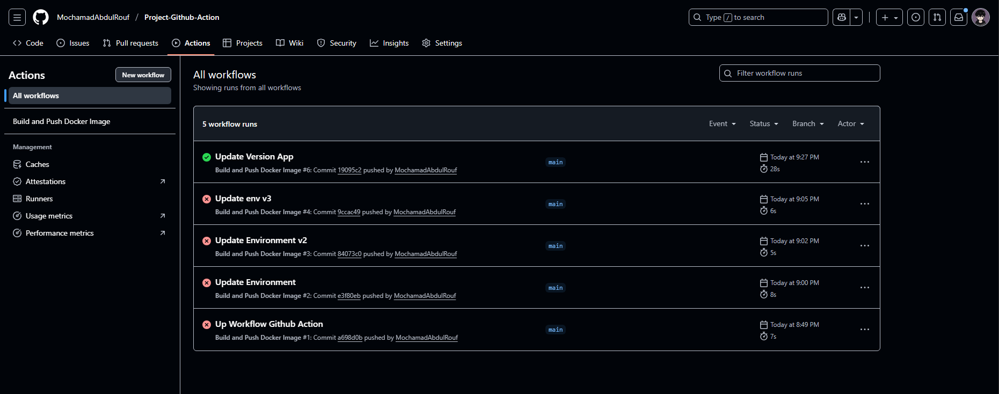
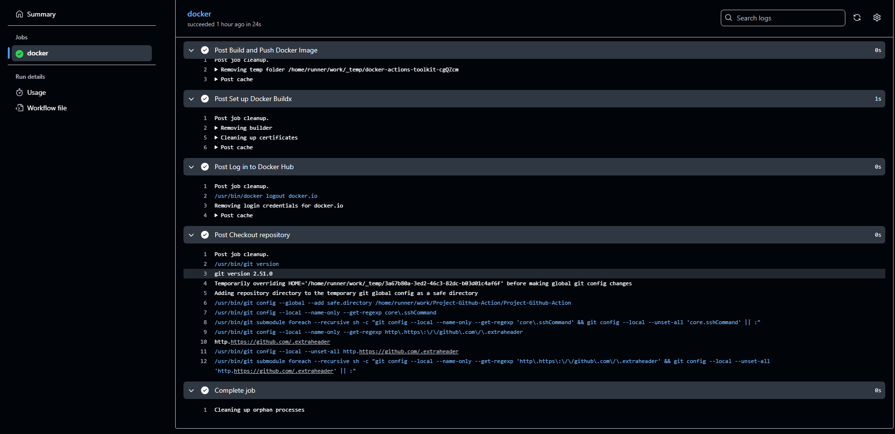

# Project Github Action
### Project ini bertujuan :
- Melakukan Build Image dari Aplikasi NodeJS yang ada di repo ini
- Melakukan Push ke Docker Hub 

## Implementasi Github Action Push Docker Image

1. Siapkan Aplikasi NodeJS, Dockerfile, Workflow Github Actionnya. Bisa dilihat Seperti di kode repo project ini.

2. Lalu masuk ke website Docker klik profile --> klik Account Settings --> Klik Personal access tokens --> Klik Generate new token --> Masukan access token deskripsi, Expiration date, Access permissions ubah jadi Read, Write, Delete --> Klik Generate --> klik Salin.

3. Masuk ke Repository --> Klik settings --> Klik Secrets and Variable --> Klik New Repository Secret --> Beri nama Secret dengan menggunakan nama Environment variable dan masukan sesuai dengan nama Environment variable di kode workflow --> Masukan isi secret contoh Token dari Docker Hub --> Klik Add Secret.

4. Jika semua sudah selesai di setting, karena kode workflow saya untuk mentrigger Github Actionya harus push dulu ke reponya jadi disini saya push reponya ketika workflow dan secret sudah siap, berikut hasilnya.

5. Hasilnya ketika workflow github action saya berhasil bekerja setelah mengalami beberapa error

